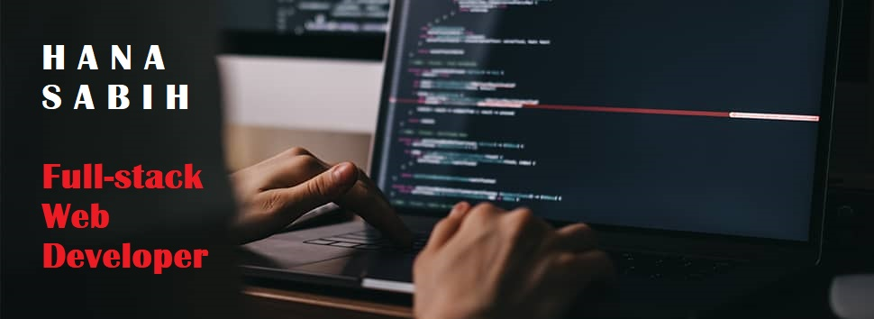
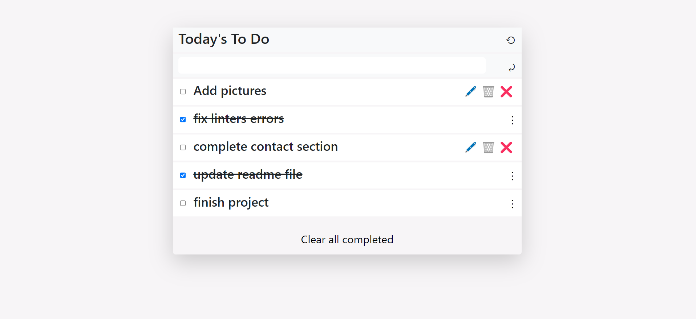
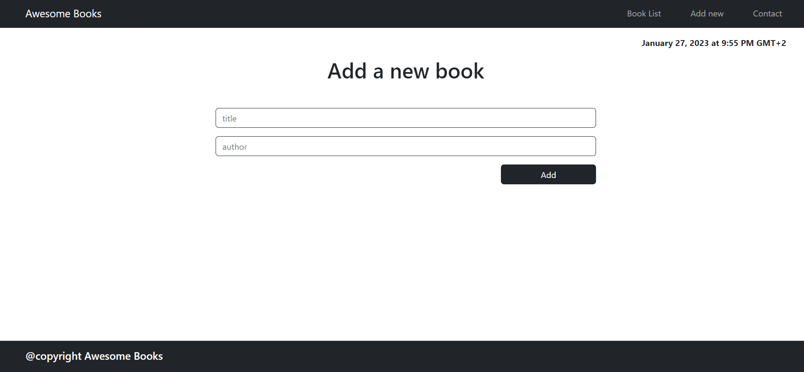
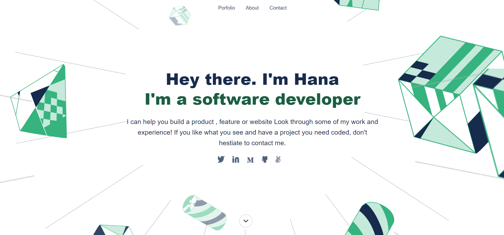
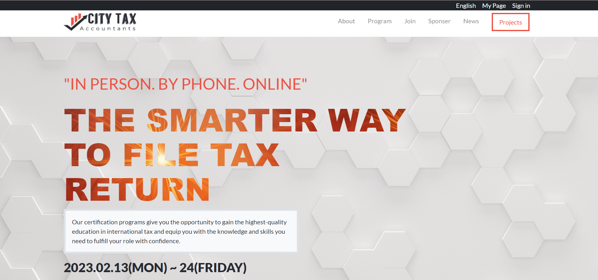

# 👋 Hi there, I'm Hana Sabih

  

- 😀 I'm a self-taught programmer from Lebanon.
- 👨‍🚀 I'm currently learning full-stack development at [Microverse](https://github.com/microverseinc).
- 🌍 I'm currently collaborating with other devs from all over the world.
- 🔭 I'm always looking for new ways to challenge myself and my creativity.
- 🧩 I love solving puzzles and working with algorithms.
- 📫 Feel free to reach out to me at: hanasabih@gmail.com

### Connect with me:

## ⚙ Languages and Tools

 
  
   
   
   
   
    
   
  
  
 
 

 
 
 ## 🏆 GitHub Trophies 

  
## 🚀 Recent Works
|  |   |   |   |
|---|---|---|---|

  

## ⚡ GitHub Stats

|  |  |
|---|---|
|    |    |

